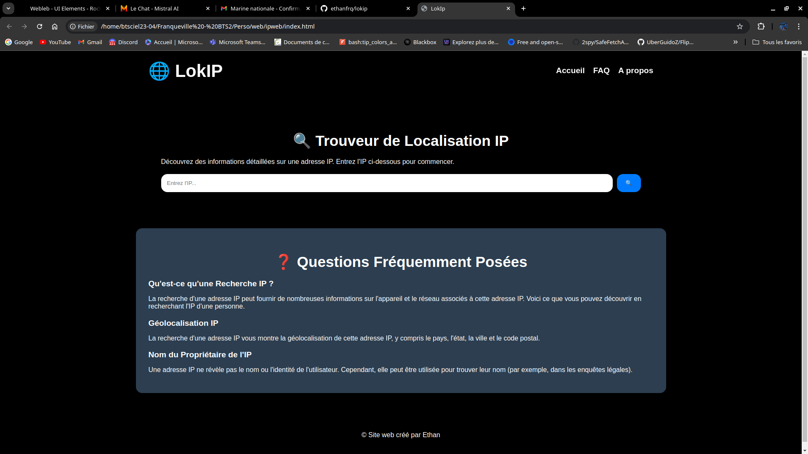

# 🌐 LokIP - Trouveur de Localisation IP

Bienvenue sur LokIP, l'outil idéal pour découvrir des informations détaillées sur une adresse IP. 🔍

## 📋 Fonctionnalités

- Recherche d'informations détaillées sur une adresse IP
- Géolocalisation IP
- Affichage sur une carte de la localisation approximative de l'IP
- Affichage d'informations supplémentaires telles que le nom d'hôte, l'ASN, l'ISP, les services, le pays, la région, la ville, le code postal, la timezone, la langue, la devise et le nom de la devise
- Affichage d'un loader pendant la recherche d'informations 🌀
- Interface utilisateur conviviale et responsive 💻

## 📝 Comment utiliser

1. Entrez une adresse IP valide dans le champ de recherche.
2. Cliquez sur le bouton de recherche ou appuyez sur Entrée.
3. Attendez que les informations soient récupérées et affichées.
4. Pour effectuer une nouvelle recherche, cliquez sur le bouton "Accueil" en bas des résultats. 🏠

## 🛠 Technologies utilisées

- HTML
- CSS
- JavaScript
- [Leaflet](https://leafletjs.com/) pour l'affichage de la carte
- [ipapi.co](https://ipapi.co/) pour la récupération des informations IP

## 📸 Aperçu

## 👤 Auteur

Ce projet a été créé par Ethan.

## 📜 Licence

Ce projet est sous licence MIT. Voir le fichier [LICENSE](LICENSE) pour plus de détails.
